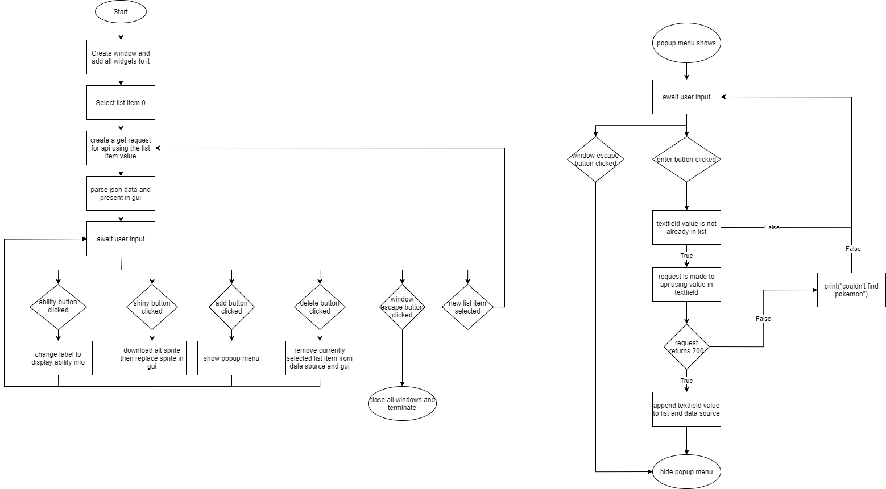
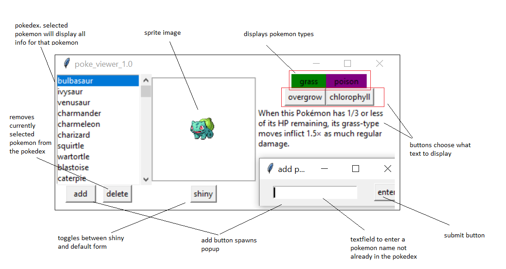

# poke viewer 1.0

- Application name: poke viewer
- Purpose: to view pokemon in their stock and shiny form with a gui along with the ability to view the types of the pokemon and the possible abilities it may have.
- Target: anyone of interest. This can be used to either gain familiarity with pokemon or better yet as an aid for players who partake in competitive battles.
- Reason for development: To attempt to gain familiarirty with the tkinter library as well as to attempt to develop in python an application with automated testing alongside the use of a CI/CD pipeline. 

Poke viewer is an application that is built entirely on python-3. Poke viewer will use 2 way communication to retrieve data from the pokeapi.co service that will be used as a backend to the gui frontend that poke viewer presents.

## 2 Way communication Break Down:
The application will take user input using the gui. there will be one listbox containing 152 objects that can be selected from and a button to perform a further action with the context of the currently selected object. 

Upon selecting one of the objects from the listbox a request will be made to pokeapi.co to retrieve the json data of the selected object. From this json another request will be made to a link contained within that will produce another json. From both files data will be parsed and displayed to the user in the form of text. For the images further api requests will be made to download them to the session.

The shiny button in the application will access the json of the currently displayed object to request another image be displayed. Clicking the button again will revert changes. This revert pattern will continue until a new object is selected from the drop down menu.

Also as an additional feature an add and remove button will be presented under the listbox allowing the user to add and remove elements from the listbox.

## Solution breakdown
The solution will have 3 classes over 4 modules. One class will serve to create pokemon objects. This will use the api to recieve json information to fill out the body of the object. Another class which will be a child of the pokemonster class will be the abilities class which holds the name of the ability and the info of the ability. A third class will deal with the presentation of the application and handle user inputs.

Modules to be used:
- The requests library will be used to download the json files from the internet
- The json library will be used to parse the json files that are downloaded
- The tkinter library will be used to generate the graphical user interface
- Pillow is required to convert pngs into tkinter images

User Interaction:
- The user will use the mouse to make a selection from a tkinter option-menu
- The user will be able to interact with various buttons via mouse click
- The user will be able to enter in a name of a pokemon to add it to the listbox

