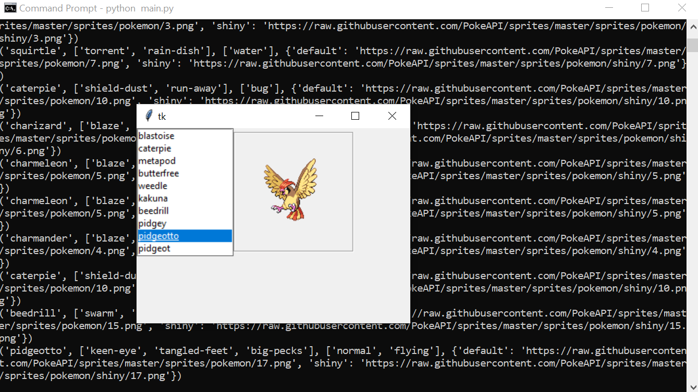

### steps for CI/CD
- ssh'd into ec2
- created a new user github-actions
- removed password for user
- su to github-actions
- generated keys
- installed python3.8

### progress report 1

### no second progress report

### final product
